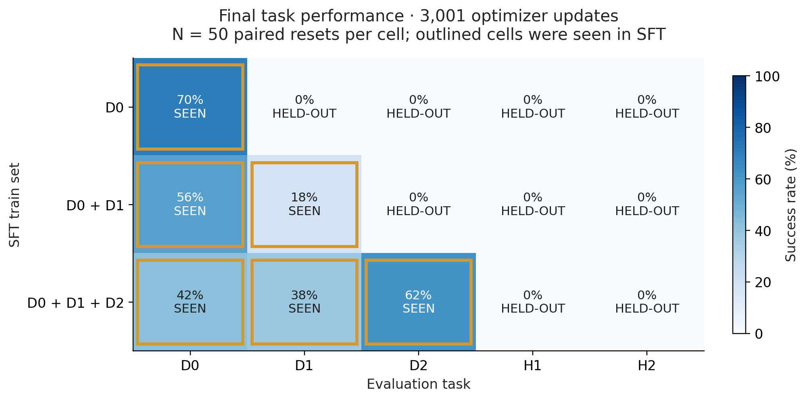
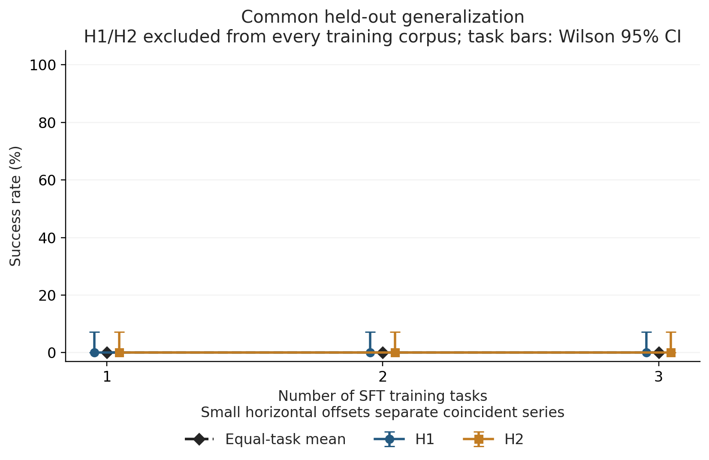
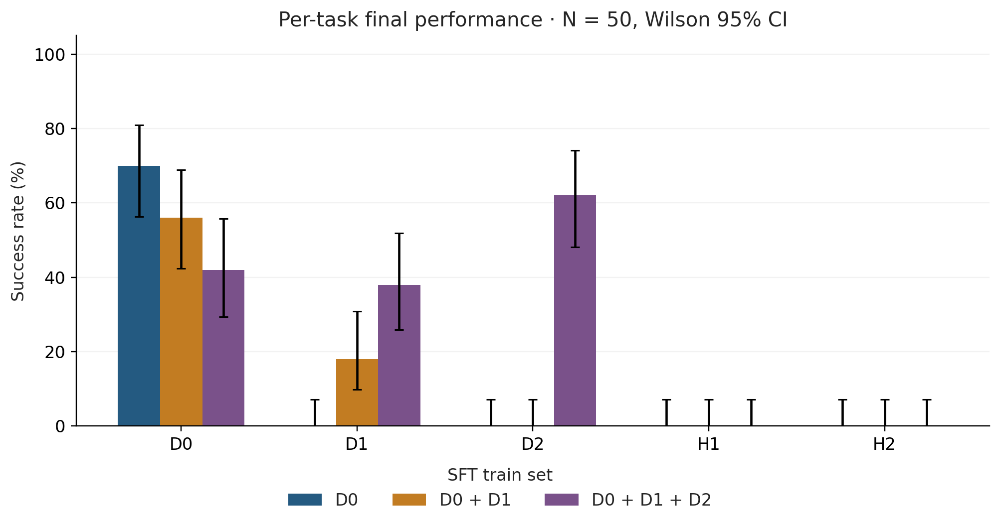
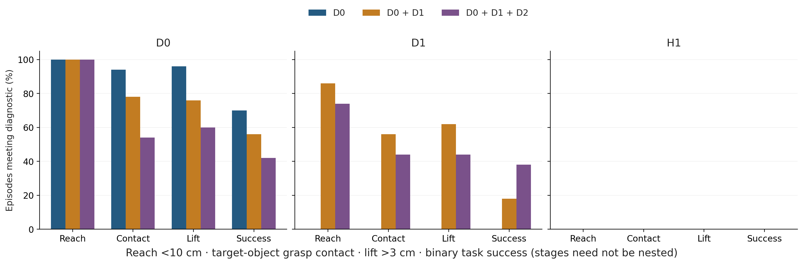
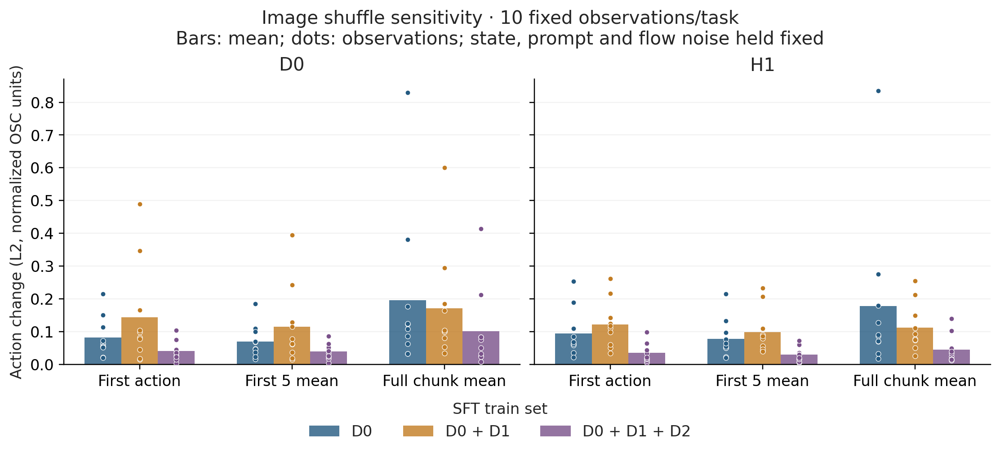

# Does multi-task SFT reduce π₀ specialization?

Primary fixed-compute comparison: three independent SFT runs, evaluated at exactly
3,001 completed optimizer updates. Each model/task result uses the same 50
registered reset seeds for that task.

## TL;DR

- **Increasing SFT from one to three tasks produced no observed common held-out
  success gain.** H1 and H2 were both 0/50 for every model. Their equal-task mean
  was **0% → 0% → 0%**. This is a finite-sample result, not proof that the true
  success probability is exactly zero.
- **D0 was partly retained, but performance declined:** 70% → 56% → 42%. The
  three-task model lost 20 of A's successful seeds and rescued 6 failures: a net
  −28 percentage points, with a paired bootstrap 95% interval of [−46, −10].
- **D1 became solvable when included in SFT:** 0% for A, 18% for B, and 38% for C.
  These gains are acquisition on a trained task; they are not held-out
  generalization.
- **Adding D2 yielded 62% on D2**, versus 0% for A/B, but did not improve H1 or H2.
  C also improved D1 over B by 20 points, while losing 14 points on D0.
- **Partial behavior improved on trained D1, but not on held-out H1.** Every
  model had zero H1 reach, grasp-contact, and lift events. D0 contact and lift
  frequencies declined as training tasks were added.
- **Image sensitivity did not increase consistently.** B was more sensitive in
  its early actions but less sensitive over the full action chunk than A. C was
  less sensitive than both on every reported measure, for both D0 and H1.
- **The experiment does not establish single-task SFT as the major cause of the
  earlier specialization.** Under this budget, additional trained skills did
  not transfer to the two common held-out tasks. Task diversity, 50/100/150 unique
  demonstrations, per-task exposure, and normalization all changed together.

## 1. Question

The preceding D0-only audit found strong improvement on the trained center-bowl
task, no full-task D1 success, and deterioration of partial D1 behavior. Its
videos showed a spatial strategy closely tied to D0. We tested whether a broader
SFT corpus would preserve behavior that responds appropriately to different
target locations and instructions.

Learning D1 after adding D1 demonstrations would show that the model can acquire
another skill. The stronger generalization test is whether the same change helps
H1 and H2, which are excluded from **every** training corpus. We keep these two
questions separate throughout this report.

## 2. Experimental design

| Model | SFT train set | Native demonstrations | Optimizer updates | Consumed D0 / D1 / D2 examples |
|---|---|---:|---:|---:|
| A | D0 | 50 | 3,001 | 24,008 / 0 / 0 |
| B | D0 + D1 | 100 | 3,001 | 12,020 / 11,988 / 0 |
| C | D0 + D1 + D2 | 150 | 3,001 | 7,954 / 8,080 / 7,974 |

| Task | Suite | Evaluation task | Seen during SFT |
|---|---|---|---|
| D0 | LIBERO Spatial | Black bowl from table center → plate | A, B, C |
| D1 | LIBERO Spatial | Black bowl next to plate → plate | B, C |
| D2 | LIBERO Goal | Bowl → stove | C |
| H1 | LIBERO Spatial | Black bowl next to ramekin → plate | None |
| H2 | LIBERO Object | Alphabet soup → basket | None |

All models started independently from the same official π₀ base. The inherited
recipe was fixed: LoRA rank/alpha 32/32, batch size 8, training seed 0, no EMA,
unchanged optimizer and learning-rate schedule, action horizon 50, and replanning
every 5 actions. B and C sampled tasks uniformly before sampling frames within a
task. Realized task shares were 50.07%/49.93% for B and
33.13%/33.66%/33.21% for C. The counts above exclude the trainer's unused final
lookahead batch.

Each model used normalization fitted only to its own training corpus. H1/H2
demonstrations and outcomes were excluded from training, normalization fitting,
hyperparameter choice, and checkpoint selection. The final 3,001-update checkpoint
was selected in advance; saves at 0/500/1,000/2,000 updates are diagnostic.

Evaluation used seeds 10000–10049, registered before results were observed.
Within each task, every model received the identical reset state, verified by
hash and independently rehashed stored state arrays. Spatial tasks used 220-step
horizons; D2/H2 used 280. All comparisons below concern this fixed evaluation
protocol. Exact task names, source versions, contracts, and provenance are in the
[methods appendix](MULTITASK_SFT_METHODS.md).

## 3. Main result

| Train set | D0 | D1 | D2 | H1 | H2 | Held-out mean |
|---|---:|---:|---:|---:|---:|---:|
| D0 | **70%** | 0% | 0% | 0% | 0% | 0% |
| D0 + D1 | **56%** | **18%** | 0% | 0% | 0% | 0% |
| D0 + D1 + D2 | **42%** | **38%** | **62%** | 0% | 0% | 0% |

**Bold cells were seen during SFT.** All other cells were held out for that model;
H1/H2 are the common held-out comparison across all three models.

The broader corpora produced success on additional trained tasks. They did not
produce any measured H1/H2 success, and D0 performance declined. Thus, the main
result is broader trained-task capability with a retention cost, without an
observed gain on the two common held-out tasks.

[Matrix PDF](multitask_sft/generalization_matrix.pdf).

| SFT train set | Eval task | Seen during SFT? | Successes/N | SR | Wilson 95% CI | Mean episode length |
|---|---|---|---:|---:|---:|---:|
| D0 | D0 | Yes | 35/50 | 70% | 56.2–80.9% | 138.46 |
| D0 | D1 | No | 0/50 | 0% | 0.0–7.1% | 220.00 |
| D0 | D2 | No | 0/50 | 0% | 0.0–7.1% | 280.00 |
| D0 | H1 | No | 0/50 | 0% | 0.0–7.1% | 220.00 |
| D0 | H2 | No | 0/50 | 0% | 0.0–7.1% | 280.00 |
| D0 + D1 | D0 | Yes | 28/50 | 56% | 42.3–68.8% | 170.70 |
| D0 + D1 | D1 | Yes | 9/50 | 18% | 9.8–30.8% | 198.90 |
| D0 + D1 | D2 | No | 0/50 | 0% | 0.0–7.1% | 280.00 |
| D0 + D1 | H1 | No | 0/50 | 0% | 0.0–7.1% | 220.00 |
| D0 + D1 | H2 | No | 0/50 | 0% | 0.0–7.1% | 280.00 |
| D0 + D1 + D2 | D0 | Yes | 21/50 | 42% | 29.4–55.8% | 173.42 |
| D0 + D1 + D2 | D1 | Yes | 19/50 | 38% | 25.9–51.8% | 173.50 |
| D0 + D1 + D2 | D2 | Yes | 31/50 | 62% | 48.2–74.1% | 161.00 |
| D0 + D1 + D2 | H1 | No | 0/50 | 0% | 0.0–7.1% | 220.00 |
| D0 + D1 + D2 | H2 | No | 0/50 | 0% | 0.0–7.1% | 280.00 |

Mean length includes successes and failures. It is bounded by the task's horizon;
all zero-success cells ran to that horizon on every episode.

## 4. Held-out generalization

For each model,
`HeldOutMean = (SR(H1) + SR(H2)) / 2 = 0%`.
Adding the close spatial task D1 and then the stove task D2 did not yield a single
successful episode on either common held-out task. The same conclusion holds for
each task individually, so the equal-task average is not hiding an improvement
on one task offset by a loss on the other.

[Held-out figure PDF](multitask_sft/heldout_generalization.pdf).

For A→B, A→C, and B→C, both H1 and H2 have **0 rescues, 0 harms, and 0-point
observed paired gain**. Their paired bootstrap intervals are [0, 0], as are the
equal-task mean intervals. This degeneracy is an expected limitation of
resampling an all-zero sample: it cannot reveal an unobserved rare success.
Each individual 0/50 cell has a Wilson 95% upper bound of 7.1%. The additional
exact per-task boundary bound for the paired difference is approximately
[−5.82, +5.82] points. We therefore conclude **no observed improvement**, not
perfectly known equality of population success rates.

H1 and H2 are two fixed tasks. The intervals describe reset-sample uncertainty
within them; they do not measure uncertainty over a broad population of unseen
tasks or over repeated training runs. We do not pool the tasks as independent
episodes to claim a tighter generalization interval.

## 5. What happens to D0/D1/D2

**Retention on D0 is incomplete.** A succeeds on 35 seeds, B on 28, and C on 21.
C still performs the task, but its 28-point loss relative to A has a paired
interval wholly below zero in this reset sample. Each adjacent 14-point loss has
a wider interval that includes zero. This distinction matters: the point
estimates decline monotonically, but not every adjacent contrast is resolved
equally well.

**D1 is acquired once it is trained.** B succeeds on 9 seeds and C on 19, compared
with none for A. C rescues 15 B failures while losing 5 B successes, for a net
20-point gain. This may reflect a beneficial interaction with the expanded
training corpus, but D1 remains a seen task for both B and C.

**D2 is acquired by C.** Its 31/50 successes compare with 0/50 for both A and B.
Neither A nor B showed successful transfer to D2 without D2 training. C's 62%
cannot be counted as held-out generalization because its SFT corpus includes D2.

| Comparison | Task | Rescue | Harm | Paired gain (points) | Paired bootstrap 95% CI (points) |
|---|---|---:|---:|---:|---:|
| A → B | D0 | 7 | 14 | −14 | [−32, +4] |
| A → B | D1 | 9 | 0 | +18 | [+8, +30] |
| A → B | D2 | 0 | 0 | 0 | [0, 0]† |
| A → C | D0 | 6 | 20 | −28 | [−46, −10] |
| A → C | D1 | 19 | 0 | +38 | [+24, +52] |
| A → C | D2 | 31 | 0 | +62 | [+48, +76] |
| B → C | D0 | 6 | 13 | −14 | [−30, +4] |
| B → C | D1 | 15 | 5 | +20 | [+4, +36] |
| B → C | D2 | 31 | 0 | +62 | [+48, +76] |

Rescue means failure→success on the identical seed/reset; harm means
success→failure. Intervals use 10,000 paired bootstrap draws. †The all-zero D2
contrast has the same boundary caveat described in Section 4. These are
pointwise intervals, without correction for multiple comparisons.

[Per-task figure PDF](multitask_sft/per_task_comparison.pdf).

| Model | Seen tasks | Mean seen SR | Unseen tasks | Mean unseen SR |
|---|---|---:|---|---:|
| A | D0 | 70.0% | D1, D2, H1, H2 | 0.0% |
| B | D0, D1 | 37.0% | D2, H1, H2 | 0.0% |
| C | D0, D1, D2 | 47.3% | H1, H2 | 0.0% |

These means use equal task weights, but their membership changes across models.
They summarize each model's evaluation set; the common H1/H2 mean is the aligned
generalization comparison.

## 6. Behavior stages

The inherited diagnostics count whether an episode ever reaches within 10 cm of
the target body, records target-object grasp contact, or lifts the bowl more
than 3 cm above its post-settle height. Counts below are out of 50 episodes.

| Task | Model | Reach | Grasp contact | Lift | Success |
|---|---|---:|---:|---:|---:|
| D0 | A | 50 | 47 | 48 | 35 |
| D0 | B | 50 | 39 | 38 | 28 |
| D0 | C | 50 | 27 | 30 | 21 |
| D1 | A | 0 | 0 | 0 | 0 |
| D1 | B | 43 | 28 | 31 | 9 |
| D1 | C | 37 | 22 | 22 | 19 |
| H1 | A | 0 | 0 | 0 | 0 |
| H1 | B | 0 | 0 | 0 | 0 |
| H1 | C | 0 | 0 | 0 | 0 |

D1-trained models show substantial partial D1 behavior relative to A. However, C's
higher D1 success than B is accompanied by *lower* reach/contact/lift counts.
Partial-stage frequency is therefore not a monotonic substitute for completing
the task. On D0, every model reaches the target, while contact and lift become
less frequent. On H1, there is no measured recovery at any of these stages.

[Behavior-stage PDF](multitask_sft/behavior_stages.pdf).

Stages need not be nested: sampled contact can miss a physical grasp, and lift
does not guarantee correct placement. These bowl-to-plate diagnostics are used
for D0/D1/H1; they are not reinterpreted as stage measures for the stove or soup
tasks.

## 7. Visual sensitivity

We used ten fixed initial observations each from D0 and H1. For each observation,
both camera images were replaced with the next seed's images from the same task,
while proprioception, prompt, and flow noise stayed fixed. The reported values
are changes in seven-dimensional predicted controller actions before clipping.
“First 5” and “full chunk” are means of per-action Euclidean distances, over five
and fifty actions respectively.

| Observation bank | Model | First-action L2 | First-5 mean L2 | Full-chunk mean L2 |
|---|---|---:|---:|---:|
| D0 | A | 0.0824 | 0.0707 | 0.1960 |
| D0 | B | 0.1446 | 0.1157 | 0.1721 |
| D0 | C | 0.0411 | 0.0398 | 0.1015 |
| H1 | A | 0.0951 | 0.0786 | 0.1790 |
| H1 | B | 0.1222 | 0.0994 | 0.1128 |
| H1 | C | 0.0356 | 0.0301 | 0.0453 |

B is more sensitive than A in its early actions but less sensitive over the full
chunk. C is less sensitive than both on every measure for both banks. Thus,
there is **no monotonic increase in measured image sensitivity** with training
task count. All differences were recomputed from the saved correct/shuffled
action arrays; the observation-bank and noise hashes match across models.

[Image-sensitivity PDF](multitask_sft/image_sensitivity.pdf).

These are descriptive perturbation measurements in normalized OSC controller
units, not distances traveled by the robot. A larger change need not be a more
appropriate change. The test neither measures attention directly nor establishes
correct visual grounding. The observation dots also show substantial variation
within the small bank; no outliers were removed.

## 8. Videos / qualitative behavior

All **42 selected clips** were fully decoded and checked against their episode
seed, outcome, reset/trajectory/image hashes, and expected frame count. They show
agent and wrist views side by side, including the terminal observation. The
[complete video index](MULTITASK_SFT_VIDEOS.md) contains every clip, visible-only
notes, and explicit records for outcome categories with zero episodes.

| Model | D0 success example | H1 failure on seed 10000 |
|---|---|---|
| A | [Seed 10002: lifts center bowl onto plate](../videos/multitask_sft/train_D0_D0_seed10002_success.mp4) | [Descends over empty center](../videos/multitask_sft/train_D0_H1_seed10000_failure.mp4) |
| B | [Seed 10000: carries center bowl onto plate](../videos/multitask_sft/train_D0_D1_D0_seed10000_success.mp4) | [Moves around plate; target bowl stays right](../videos/multitask_sft/train_D0_D1_H1_seed10000_failure.mp4) |
| C | [Seed 10002: lifts center bowl onto plate](../videos/multitask_sft/train_D0_D1_D2_D0_seed10002_success.mp4) | [Repositions near plate; target bowl stays right](../videos/multitask_sft/train_D0_D1_D2_H1_seed10000_failure.mp4) |

C's [D2 success on seed 10002](../videos/multitask_sft/train_D0_D1_D2_D2_seed10002_success.mp4)
shows the bowl carried onto the stove. Its
[D2 failure on seed 10000](../videos/multitask_sft/train_D0_D1_D2_D2_seed10000_failure.mp4)
shows the gripper moving above the stove while the bowl remains on the table.
These illustrate the difference between moving toward a destination and
successfully transporting the object.

Selection was fixed to the first two successes and first two failures in seed
order where available. These examples describe visible behavior; they are not
an independent estimate of its prevalence and do not imply the model's intent.

## 9. Interpretation

**Single-task SFT remains a plausible contributor to specialization, but this
experiment does not establish it as the major cause.** The concrete intervention
tested here—expanding from one task to two or three at a fixed update budget—did
not recover success or partial H1 behavior on the common held-out tasks.
It expanded trained-task capability, with a cost to D0 performance.

This is not a clean estimate of the isolated effect of task diversity. The
primary design changes four connected factors:

1. Task diversity increases from one to three task identities.
2. Unique training data increases from 50 to 100 to 150 demonstrations.
3. Fixed total updates spread exposure across tasks: D0 receives 24,008, 12,020,
   and 7,954 consumed examples in A, B, and C.
4. Each corpus supplies its own valid deployment normalization, so the input and
   output scaling also changes.

The D0 loss could involve interference, reduced exposure, normalization, or a
combination. The D1 gain from B to C is compatible with a useful interaction
between trained tasks, but it cannot isolate that mechanism from corpus and
normalization changes. Neither observation substitutes for the negative common
held-out result.

The preregistered secondary design was a deterministic 50-total-demo control,
with 25/25 demos for B and 17/17/16 for C. **It was not run.** Repeating B/C would
add approximately five hours of training, based on the measured primary runs,
before its additional evaluations. That would materially extend this study.
Consequently, the experiment leaves the diversity-versus-data and per-task
exposure explanations unresolved.

## 10. Limitations

- One training seed per condition gives no estimate of training-run variability.
  Paired confidence intervals concern these fixed policies and reset samples.
- Two common held-out tasks and 50 episodes per cell provide a narrow, floor-bound
  generalization test. Zero observed successes do not prove zero underlying
  probability, and do not characterize all unseen LIBERO tasks. Optional H3 was
  not included.
- The fixed-compute comparison confounds diversity, unique data, per-task exposure,
  and normalization. No secondary data- or exposure-matched run resolves them.
- Results use generated-seed resets, the inherited controller/action contract,
  and the stated finite horizons. They should not be treated as a standard
  full-suite LIBERO benchmark score.
- Contact/lift flags are descriptive proxies. The image test uses only ten
  initial observations per task, not observations throughout the rollout, and
  does not identify an attention or grounding mechanism.
- Parallel execution passed an exact serial comparison on two registered D0
  seeds. That is bounded reproducibility evidence, not a proof for every possible
  trajectory. The interrupted first C training attempt was excluded; the final
  C run restarted independently with the original recipe.

The [methods appendix](MULTITASK_SFT_METHODS.md) records the reproducibility
details. The [machine-readable primary analysis](multitask_sft/evidence/setup/final_checkpoint_analysis.json)
contains all task-wise paired comparisons and task-membership summaries.
