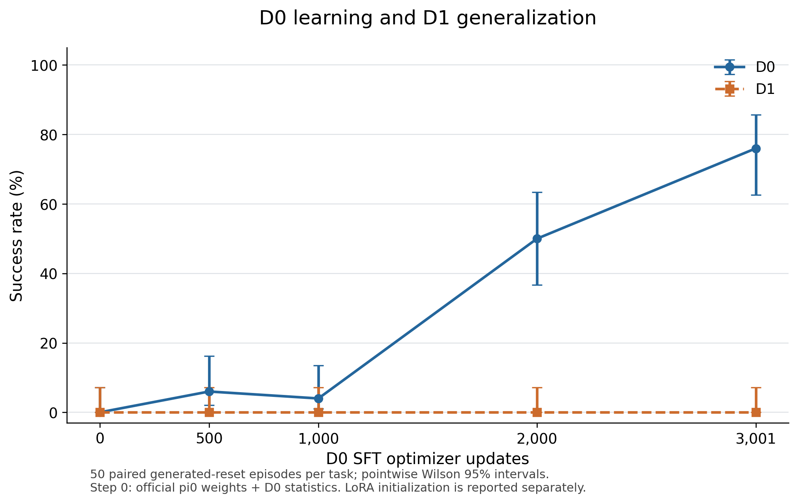
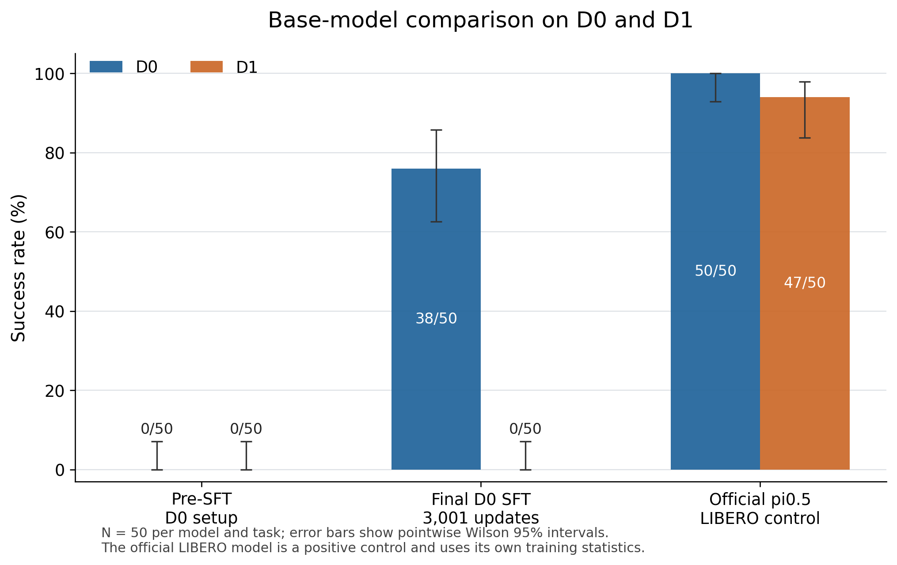
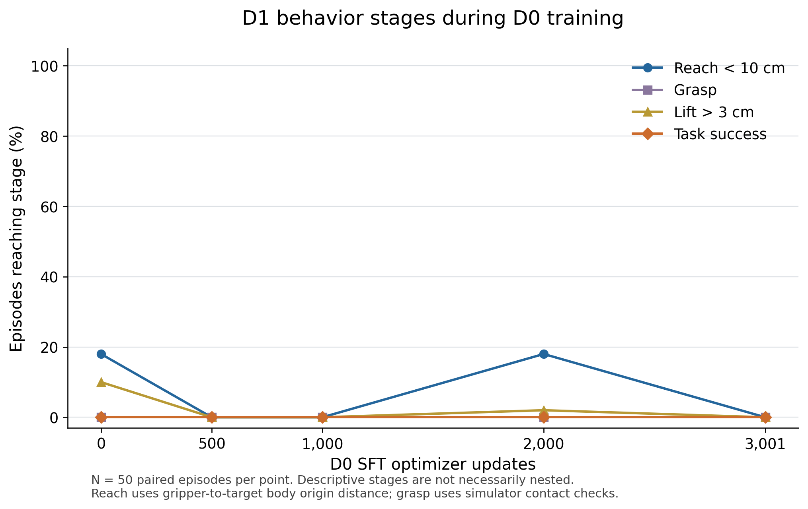

# pi0 D0/D1 base-model sanity audit

## TL;DR

- **No D1 successes were observed in any measured pre-SFT or D0-only model.**
- We evaluated the pre-SFT D0 setup and four fixed D0-only checkpoints on the same 50 fresh scenes per task. Before SFT: D0 **0/50 (0%)**, D1 **0/50 (0%)**.
- After 3,001 D0 updates: D0 **38/50 (76%)**, D1 **0/50 (0%)**. D1 trajectory: 0 updates: 0/50, 500 updates: 0/50, 1,000 updates: 0/50, 2,000 updates: 0/50, 3,001 updates: 0/50.
- The official LIBERO positive control achieved D0 **50/50 (100%)** and D1 **47/50 (94%)**.
- We separately checked zero-update LoRA initialization: D0 0/50, D1 0/50. The pinned code randomly initializes both factors, so it is not identical to the dense pretrained baseline.
- These measurements do not show forgetting of previously demonstrated D1 success. The earlier residual experiment started from a base with no observed full-task D1 success.

## 1. Experimental question

The previous experiment learned the center-bowl task D0 but showed zero success on D1, where the black bowl starts next to the plate. The robot, destination and pick/place primitive are shared. Inspection of the unchanged BDDL files also shows a distractor relocation: D0 has a second bowl near the plate, while D1 places that bowl near the ramekin and leaves the center empty. This is not a pure language-only intervention. We asked whether D0 SFT erased a skill the pretrained model already had, whether the skill was absent to begin with, or whether the LIBERO inference bridge could not execute the task correctly.

**Raw pi0_base is not directly evaluable under a justified LIBERO action contract.** Its official assets do not include LIBERO normalization. We did not substitute another robot's statistics. Our primary pre-SFT baseline is official pi0 weights **plus the D0-specific LIBERO transforms and statistics**, with zero gradient updates. This is already an embodiment-aligned setup, not a raw generic zero-shot LIBERO score.

## 2. Models compared

| Model | Training data / alignment | Optimizer updates | Purpose |
|---|---|---:|---|
| Pre-SFT D0 setup | Official pi0 weights; statistics from 50 D0 demos | 0 | Primary pre-SFT baseline |
| LoRA initialization | Same D0 statistics; V4 random LoRA factors | 0 | Isolate initialization effects |
| D0-only SFT trajectory | Exactly 50 D0 demos; no D1 training | 500 / 1,000 / 2,000 | Measure D0 learning and D1 generalization |
| Final D0-only SFT | Exactly the same D0 dataset | 3,001 | Match the V4 training budget |
| Official pi0.5 LIBERO | Official LIBERO fine-tuning corpus | Released checkpoint; no training here | Positive control only |

D0-only training used LoRA rank 32, alpha 32, batch 8, seed 0, all 50 D0 demonstrations and the existing temporal alignment, cameras, optimizer and schedule. No D1 data entered SFT or D0 statistics. The official pi0.5 control uses its own released normalization and architecture; it is an environment/inference check, not a competing source-only training method.

## 3. Main results

N = 50 per task and model. Brackets contain pointwise Wilson 95% confidence intervals for success rate.

| Model/checkpoint | D0 SR [95% CI] | D1 SR [95% CI] | D0 successes | D1 successes |
|---|---:|---:|---:|---:|
| Pre-SFT (official weights + D0 statistics) | 0% [0.0%–7.1%] | 0% [0.0%–7.1%] | 0/50 | 0/50 |
| 500 D0 updates | 6% [2.1%–16.2%] | 0% [0.0%–7.1%] | 3/50 | 0/50 |
| 1,000 D0 updates | 4% [1.1%–13.5%] | 0% [0.0%–7.1%] | 2/50 | 0/50 |
| 2,000 D0 updates | 50% [36.6%–63.4%] | 0% [0.0%–7.1%] | 25/50 | 0/50 |
| 3,001 D0 updates | 76% [62.6%–85.7%] | 0% [0.0%–7.1%] | 38/50 | 0/50 |
| LoRA initialization (0 updates) | 0% [0.0%–7.1%] | 0% [0.0%–7.1%] | 0/50 | 0/50 |
| Official pi0.5 LIBERO (positive control) | 100% [92.9%–100.0%] | 94% [83.8%–97.9%] | 50/50 | 47/50 |

| Model/checkpoint | Episodes per task | Mean D0 length, actions | Mean D1 length, actions |
|---|---:|---:|---:|
| Pre-SFT (official weights + D0 statistics) | 50 | 220.0 | 220.0 |
| 500 D0 updates | 50 | 215.8 | 220.0 |
| 1,000 D0 updates | 50 | 215.8 | 220.0 |
| 2,000 D0 updates | 50 | 171.5 | 220.0 |
| 3,001 D0 updates | 50 | 140.4 | 220.0 |
| LoRA initialization (0 updates) | 50 | 220.0 | 220.0 |
| Official pi0.5 LIBERO (positive control) | 50 | 97.8 | 105.7 |

Failures terminate at the fixed 220-action horizon. Episodes and checkpoints are repeated measurements on the same scene seeds, not independent samples to be pooled.

## 4. SFT trajectory

[PDF figure](pi0_audit/sft_trajectory.pdf). D0 learning was weak early: 3/50 (6%) at 500 updates and 2/50 (4%) at 1,000. It then rose to 25/50 (50%) at 2,000 and 38/50 (76%) at the final checkpoint, from 0/50 before training. The small early dip is an observed count difference in one training run, not evidence of a reliable degradation. For D1, 0 updates: 0/50, 500 updates: 0/50, 1,000 updates: 0/50, 2,000 updates: 0/50, 3,001 updates: 0/50. No intermediate D1 success was observed at the three registered intermediate checkpoints.

The primary zero point uses dense official weights. The separate LoRA-initialization row prevents a random adapter perturbation from being mistaken for a gradient update. Comparing the final model with that auxiliary zero-update state gives a D1 change of +0 percentage points, with 0 gained and 0 lost successes among 50 pairs.

| D0 optimizer updates | Task | Paired N | Change from primary step 0, pp | Gained successes | Lost successes | 95% change interval, pp |
|---:|---|---:|---:|---:|---:|---:|
| 500 | D0 | 50 | +6 | 3 | 0 | [+0.0, +14.0] |
| 500 | D1 | 50 | +0 | 0 | 0 | [-5.8, +5.8] |
| 1,000 | D0 | 50 | +4 | 2 | 0 | [+0.0, +10.0] |
| 1,000 | D1 | 50 | +0 | 0 | 0 | [-5.8, +5.8] |
| 2,000 | D0 | 50 | +50 | 25 | 0 | [+36.0, +64.0] |
| 2,000 | D1 | 50 | +0 | 0 | 0 | [-5.8, +5.8] |
| 3,001 | D0 | 50 | +76 | 38 | 0 | [+64.0, +88.0] |
| 3,001 | D1 | 50 | +0 | 0 | 0 | [-5.8, +5.8] |

Intervals use paired percentile bootstrapping where informative; constant outcomes use explicit conservative bounds. They are pointwise and do not correct for inspecting multiple checkpoints. Baseline self-comparison is exactly zero and is omitted.

## 5. Positive-control result

[PDF figure](pi0_audit/positive_control_comparison.pdf). The official `pi05_libero` model achieved D0 50/50 (100%) and D1 47/50 (94%) through the same environment, task language, camera adapter and bounded OSC execution path. This establishes that this bridge can produce D1 successes; the D0-only model’s floor cannot be explained by a bridge that universally prevents the task.

The control has LIBERO training exposure and a different architecture and normalization scheme. It cannot establish what generic pretrained pi0 knew, nor rule out every model-specific contract problem. Its native prediction horizon is 10 versus 50 for pi0; both execute five actions per replan. Our generated scene resets also differ from official benchmark initialization files.

## 6. Behavior analysis

[Evaluation video index](PI0_D0_D1_SANITY_VIDEOS.md), with visible-behavior notes and full decode/frame-count verification. Representative clips:

- [Pre-SFT D1 failure, seed 9000](pi0_audit/videos/step0000_D1_seed9000_failure.mp4)
- [Final D0-only model: D1 failure, seed 9000](pi0_audit/videos/step3001_D1_seed9000_failure.mp4)
- [Official LIBERO control: D1 success, seed 9000](pi0_audit/videos/official_libero_D1_seed9000_success.mp4)
- [Final D0-only model: D0 success, seed 9000](pi0_audit/videos/step3001_D0_seed9000_success.mp4)

Videos show agentview and wrist views side by side, including the terminal observation. The selected baseline and official-control clips were deterministically replayed after the video requirement arrived; their seed, outcome, length and reset/trajectory/image hashes match the original evaluated episodes. These replays do not add episodes to the reported success rates.

In the retained final D1 clips for seeds 9000 and 9001, the gripper descends over the empty center region, where the D0 target would be, and then moves toward the plate. The D1 target bowl remains beside the plate. The final D0 success clips show the center bowl carried onto the plate. These are visible motions in selected examples; they do not identify an internal cause or establish that the model ignored language.

Reach means EEF-to-target-body distance below 10 cm at any time; grasp uses robosuite's target-object contact check; lift means the target bowl rises more than 3 cm above its post-settle initial height; placement is binary LIBERO success. These are descriptive, not necessarily nested stages. The grasp-contact flag is sampled at action boundaries and can miss physical acquisition; the control's successful episodes without a registered flag demonstrate that limitation.

At the final D0 checkpoint, reach occurred in 50/50 episodes, grasp flags in 48/50, and lifts in 49/50, with 38/50 successful placements. The two retained D0 failures carry the bowl near the plate but end with it still in the gripper. The following table tracks D1 separately.

| Model/checkpoint | D1 episodes | Reach | Grasp | Lift >3 cm | Successful placement |
|---|---:|---:|---:|---:|---:|
| Pre-SFT (official weights + D0 statistics) | 50 | 9/50 (18%) | 0/50 (0%) | 5/50 (10%) | 0/50 (0%) |
| 500 D0 updates | 50 | 0/50 (0%) | 0/50 (0%) | 0/50 (0%) | 0/50 (0%) |
| 1,000 D0 updates | 50 | 0/50 (0%) | 0/50 (0%) | 0/50 (0%) | 0/50 (0%) |
| 2,000 D0 updates | 50 | 9/50 (18%) | 0/50 (0%) | 1/50 (2%) | 0/50 (0%) |
| 3,001 D0 updates | 50 | 0/50 (0%) | 0/50 (0%) | 0/50 (0%) | 0/50 (0%) |
| LoRA initialization (0 updates) | 50 | 8/50 (16%) | 1/50 (2%) | 11/50 (22%) | 0/50 (0%) |
| Official pi0.5 LIBERO (positive control) | 50 | 47/50 (94%) | 45/50 (90%) | 47/50 (94%) | 47/50 (94%) |

[PDF](pi0_audit/d1_behavior_stages.pdf). From primary step 0 to the final D0 model, D1 reaches changed from 9/50 to 0/50, grasp flags from 0/50 to 0/50, and lifts from 5/50 to 0/50. These partial-behavior measurements complement full-task success rates and help describe where progress stalls, but they are not a validated universal stage classifier. In particular, object lift alone does not establish a stable grasp.

For ten identical D1 reset states, we compared the first predicted chunk and first five executed commands with primary step 0. L1 sums absolute differences over seven command dimensions; L2 is Euclidean command-vector difference, averaged over states and actions.

| Model / update count | Action representation | Paired states | Actions per state | Mean L1 difference | Mean L2 difference |
|---|---|---:|---:|---:|---:|
| Pre-SFT (official weights + D0 statistics) | Predicted chunk (pre-clip) | 10 | 50 | 0.0000 | 0.0000 |
| Pre-SFT (official weights + D0 statistics) | First 5 executed | 10 | 5 | 0.0000 | 0.0000 |
| 500 D0 updates | Predicted chunk (pre-clip) | 10 | 50 | 1.7935 | 1.0628 |
| 500 D0 updates | First 5 executed | 10 | 5 | 1.5706 | 1.0465 |
| 1,000 D0 updates | Predicted chunk (pre-clip) | 10 | 50 | 2.1534 | 1.2801 |
| 1,000 D0 updates | First 5 executed | 10 | 5 | 2.0294 | 1.3000 |
| 2,000 D0 updates | Predicted chunk (pre-clip) | 10 | 50 | 2.0793 | 1.2670 |
| 2,000 D0 updates | First 5 executed | 10 | 5 | 1.8483 | 1.2538 |
| 3,001 D0 updates | Predicted chunk (pre-clip) | 10 | 50 | 2.1905 | 1.3063 |
| 3,001 D0 updates | First 5 executed | 10 | 5 | 1.9632 | 1.2753 |
| LoRA initialization (0 updates) | Predicted chunk (pre-clip) | 10 | 50 | 0.0756 | 0.0465 |
| LoRA initialization (0 updates) | First 5 executed | 10 | 5 | 0.0261 | 0.0152 |

Predicted chunks are before controller clipping; executed commands are after clipping. These are normalized OSC controller commands, **not physical meters**. A large difference shows changed commands, not by itself a stereotyped D0 strategy or ignored language. Fixed-seed videos and per-dimension differences are retained for qualitative inspection. Every model's actual inference path checked the task string immediately before tokenization: D0 “pick up the black bowl from table center and place it on the plate”; D1 “pick up the black bowl next to the plate and place it on the plate”.

## 7. Normalization and action-distribution audit

Primary step 0, the auxiliary initialization and every D0 SFT checkpoint use the identical D0-only mean/std statistics. The official pi0.5 control uses its own checkpoint's 1st/99th-percentile statistics. Each model's inverse normalization occurs exactly once before the shared OSC clipping/execution adapter. No statistics were changed after inspecting D1.

The unique-frame diagnostic covers **50 D0 demonstrations / 5,832 aligned pairs** and **50 D1 demonstrations / 5,913 aligned pairs**. D1 data were read only for this diagnostic. The original chunked loader weights overlapping/padded actions differently from these unique-frame summaries.

| Action dimension | D0 observed range (N=5,832) | D1 observed range (N=5,913) | D1 outside D0 range | D1 outside D0 1st–99th percentiles | D1 with absolute D0 z score >3 |
|---|---:|---:|---:|---:|---:|
| x | [-0.737, 0.938] | [-0.862, 0.938] | 0.39% | 5.21% | 0.12% |
| y | [-0.680, 0.806] | [-0.924, 0.782] | 3.37% | 16.98% | 6.24% |
| z | [-0.938, 0.938] | [-0.938, 0.938] | 0.00% | 1.71% | 0.00% |
| rotation x | [-0.114, 0.128] | [-0.164, 0.189] | 1.25% | 6.95% | 6.83% |
| rotation y | [-0.272, 0.216] | [-0.343, 0.250] | 0.46% | 5.01% | 2.33% |
| rotation z | [-0.186, 0.155] | [-0.267, 0.137] | 2.49% | 12.53% | 8.37% |
| gripper | [-1.000, 1.000] | [-1.000, 1.000] | 0.00% | 0.00% | 0.00% |

D1 command tails differ: the largest fraction outside a D0 observed action range is 3.37%; the largest fraction outside its central 98% range is 16.98%. This does not indicate wholesale incompatibility of the seven-dimensional action space, but tail and state shifts remain plausible contributors to poor generalization.

The following state fractions use the same 5,913 D1 observations (50 demonstrations):

| State dimension (D1 N=5,913) | D1 outside D0 observed range | D1 outside D0 1st–99th percentiles | D1 with absolute D0 z score >3 |
|---|---:|---:|---:|
| EEF x | 0.19% | 1.57% | 0.00% |
| EEF y | 19.11% | 25.08% | 0.00% |
| EEF z | 0.36% | 5.77% | 0.00% |
| axis-angle x | 9.91% | 21.43% | 7.39% |
| axis-angle y | 5.83% | 19.09% | 22.56% |
| axis-angle z | 5.63% | 13.55% | 9.74% |
| gripper joint 1 | 3.74% | 12.57% | 0.00% |
| gripper joint 2 | 0.29% | 3.40% | 0.00% |

The D0 mean/std transform is affine and does not clip values to these demonstration ranges; an out-of-range value is not automatically an invalid OSC command. The shared controller clipping remains at [-1, 1], independently of the observed demo ranges. These comparisons diagnose distribution shift; they do not prove normalization caused failure. Orientation-coordinate differences and demonstration timing limit interpretation. Native D1 action trajectories are not claimed to reproduce identically in this simulator version, and no alternate normalizer was tested or fitted.

## 8. Interpretation

We observed no successful D1 completions before D0 gradient updates, and none emerged at the registered checkpoints. These results do **not** support the claim that D0 SFT destroyed previously demonstrated D1 competence. Instead, the pretrained model under D0 embodiment alignment never demonstrated successful D1 execution in this audit. Zero successes in 50 episodes does not establish a true success probability of zero or exclude useful partial skills.

The four questions remain separate:

1. **Does generic pi0 know LIBERO?** This audit cannot assign a raw zero-shot success rate without LIBERO statistics. It measures the explicitly D0-aligned pre-SFT setup.
2. **Does D0 SFT teach D0?** D0 changes from 0/50 to 38/50; the registered intermediate rates are in the main table.
3. **Does D0 SFT destroy D1 behavior?** The measured D1 trajectory is 0 updates: 0/50, 500 updates: 0/50, 1,000 updates: 0/50, 2,000 updates: 0/50, 3,001 updates: 0/50. The initial LoRA model separately achieved 0/50; causal language must respect that initialization comparison and the paired uncertainty.
4. **Does the official LIBERO-finetuned checkpoint work here?** The official control achieved 47/50 on D1 and 50/50 on D0. The bridge passed the positive control.

## 9. Implication for residual RL

The final D0-only base had D1 success 0/50 in this independent audit. A bounded residual therefore had to achieve successful D1 execution from a base with no demonstrated full-task success. That is a harder starting point than correcting occasional failures in a mostly successful policy; the measured reach, grasp and lift behavior still matters because partial skills may remain useful. This makes the base prior a central limitation of the earlier D0-base → D1-residual experiment; it does not prove residual RL is impossible or identify a single optimization failure.

The prior V4 experiment, its frozen 3,001-update base definition, and its negative results remain unchanged. We did not train a residual, tune using D1, alter normalization, or retrospectively replace that scientific base with an intermediate checkpoint.

## 10. Limitations

- One training seed and 50 paired episodes per task limit precision; checkpoint comparisons are correlated and exploratory. The fixed milestones cannot exclude short-lived behavior between evaluated checkpoints.
- The primary baseline includes D0 statistics. Raw pretrained LIBERO competence remains undefined under the missing deployment contract.
- Random LoRA initialization is a separate perturbation, explicitly measured. Hardware differs from V4, so identical configuration does not imply bitwise-identical learned weights.
- The pi0.5 positive control has LIBERO exposure, another normalization scheme and another horizon; it validates achievable execution, not equality of model assumptions.
- The task pair changes distractor placement as well as target location, so failures cannot be attributed to language neglect alone. Generated resets differ from the published benchmark protocol. Historical raw seed artifacts were unavailable in this clone; freshness was checked against tracked registrations and reports.
- The actual GPU has 64 GiB. Measured usage informs the requested 48 GB design but is not a direct 48 GB hardware demonstration.

## Technical appendix

Full contracts, definitions and source links: [methods](pi0_audit/METHODS.md). Inspectable data: [success table CSV](pi0_audit/success_rates.csv), [episode CSV](pi0_audit/episodes.csv), [paired changes](pi0_audit/paired_changes.json), [action differences](pi0_audit/action_differences.csv), [first commands](pi0_audit/first_actions.csv), [normalization diagnostic](pi0_audit/normalization_audit.json).

Runtime: NVIDIA CMP 170HX, 65,536 MiB VRAM, driver 610.57.04; Torch 2.7.1+cu128, JAX/JAXlib/CUDA plugin/PJRT 0.5.3, MuJoCo 3.2.7, robosuite 1.4.1. OpenPI `981483dca0fd9acba698fea00aa6e52d56a66c58`; LIBERO `8f1084e3132a39270c3a13ebe37270a43ece2a01`. Seeds 9000–9049; first-action states 9000–9009. D0 normalization SHA256 `b4ea07567b2cc2bbd5670167efa540730ef4e98b3e507ce1610473c948401f44`.

Primary pre-SFT checkpoint: `/workspace/audit-checkpoints/pi0_base` with explicit D0 statistics. Auxiliary LoRA initial checkpoint: `/workspace/audit-run/sft/checkpoints/pi0_libero_seen_lora32/EXP-001/0`. Later directories are `500`, `1000`, `2000`, `3001`, and correspond to exactly those completed updates; the final directory is not historical V4's `3000`. Official control: `/workspace/audit-checkpoints/pi05_libero`, downloaded from `gs://openpi-assets/checkpoints/pi05_libero` ([official OpenPI checkpoint listing](https://github.com/Physical-Intelligence/openpi#pre-trained-checkpoints)).

| Stage | Wall time, minutes | Sampled whole-device peak, GiB |
|---|---:|---:|
| Pre-SFT (official weights + D0 statistics) | 50.1 | 9.01 |
| Pre-SFT (official weights + D0 statistics) (video replay) | 2.7 | 9.01 |
| 1,000 D0 updates | 54.9 | 9.01 |
| 2,000 D0 updates | 49.0 | 9.01 |
| 3,001 D0 updates | 45.3 | 9.01 |
| 500 D0 updates | 54.7 | 9.01 |
| LoRA initialization (0 updates) | 52.1 | 9.01 |
| Official pi0.5 LIBERO (positive control) | 26.7 | 9.35 |
| Official pi0.5 LIBERO (positive control) (video replay) | 2.8 | 9.02 |
| D0-only SFT | 158.7 | 32.34 |

Reproduce using `scripts/pld/audit_pi0.py`, `audit_pi0_pipeline.py`, `audit_pi0_normalization.py`, `report_pi0_audit.py` and `write_pi0_audit_report.py`. See [preregistration](plans/2026-09-16-pi0-audit.md) for settings and sequence. Audit entrypoint snapshots were added before D0 evaluation/training; the already-running official control's later source capture is explicitly labeled. Final verification: **126 tests passed** (including the real MuJoCo integration test); **4 optional tests skipped**; [test log](pi0_audit/evidence/verification/final-tests.log). All **38 published videos** fully decode and match their expected frame counts and episode identities; [video verification](pi0_audit/video_verification.json). Training completed without OOM or reduced scientific settings, with a sampled peak of **32.34 GiB**. Historical tracked V2/V3/V4 files remain unchanged. The [evidence bundle](pi0_audit/evidence/README.md) includes the original results, runtime/source records and reproducible figure inputs.
